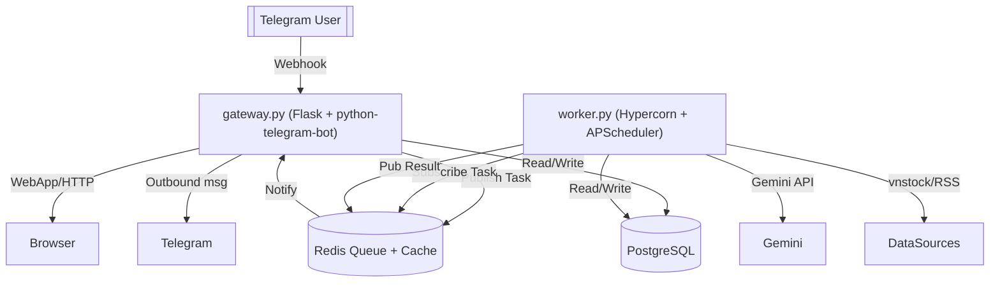

# 📈 Telegram Stock Bot

> Trợ lý Telegram chuyên xử lý dữ liệu chứng khoán Việt Nam theo thời gian thực, chạy trên kiến trúc Gateway–Worker, và dùng Gemini để sinh báo cáo AI cho nhà đầu tư.


## Tổng quan

Bot phục vụ toàn bộ trải nghiệm theo dõi thị trường: người dùng gõ mã cổ phiếu để thêm mã vào watchlist, nhận cảnh báo realtime, đọc bản tin sáng và gọi báo cáo danh mục. Hậu trường được tách thành hai tiến trình độc lập (`gateway.py` và `worker.py`) giao tiếp qua Redis Pub/Sub để đảm bảo bot phản hồi nhanh ngay cả khi các tác vụ AI mất nhiều thời gian.

## Nổi bật

### Telegram UX & Alerts
- Watchlist không giới hạn (Pro) với thao tác nhanh `/add`, `/remove`, quick reply hoặc gõ thẳng mã (`gateway.py`).
- Xem hồ sơ doanh nghiệp nhanh qua lệnh hoặc nút bấm.
- Stock alert tự động khi biên độ ±2% và bộ Market Monitor cho VN30F1M, VNINDEX, VN30 với ngưỡng ±5 điểm (`worker.py`).
- Bật/tắt các loại thông báo ngay trong phần `⚙️ Tài khoản`.

### AI & Tự động hóa (Gemini)
- Morning Digest 07:00, EOD Summary 15:00 và Weekly Report 09:00 Chủ nhật với tường thuật AI (`worker.py` – `job_daily_digest`, `job_eod_summary`, `job_weekly_report`).
- Tạo báo cáo danh mục, cache kết quả trong `report_cache.py` để tránh gọi Gemini trùng lặp.
- Soi hồ sơ doanh nghiệp và AI knowledge base (`ai_knowledge.py`) cho trả lời chat tự động.
- Bộ agent thủ công (`/agent`, `/agentlog`) cho phép admin kích hoạt pipeline vĩ mô/doanh nghiệp/kỹ thuật và đọc kết quả từ Redis cache trong vòng 24h.

### Web surfaces & Admin
- Admin dashboard (route `/admin/dashboard`) để xem user, gia hạn Pro, broadcast, cập nhật ghi chú và theo dõi doanh thu.
- Thanh toán tự động SePay qua webhook `/sepay-webhook` (optional) với mã đơn PAY_xxx.
- **Contribute WebApp:** Giao diện cho phép Pro User đóng góp ghi chú/insight về mã cổ phiếu. Hỗ trợ soạn thảo, xem trạng thái duyệt (Pending/Approved/Rejected) và lịch sử đóng góp.

### Data & Cache Layer
- PostgreSQL cho người dùng, watchlist, lịch sử thanh toán, log tin nhắn (`db_utils.py`).
- Redis dùng cho Pub/Sub, cache báo cáo, cache profile, cache “tin đã đọc”, queue tác vụ và lưu job APScheduler (`redis_client.py`, `report_cache.py`, `profile_cache.py`, `news_seen_cache.py`).
- `manual_valuation.py` cung cấp hàm `fetch_manual_pe_pb` cùng Redis TTL 24h để bảo toàn hạn mức API vnstock.
- Dữ liệu macro Tổng cục Thống Kê lưu tại `GSO_Data/` được tái sử dụng cho Morning Digest.
- `stock_personalization` table (PostgreSQL) nâng cấp để hỗ trợ quy trình Crowdsourcing: lưu trữ ghi chú từ cộng đồng, trạng thái kiểm duyệt và thông tin người đóng góp.

## Kiến trúc & luồng xử lý



- `gateway.py`: host webhook `/webhook`, SePay webhook, các trang WebApp (digest, admin, contribute) và toàn bộ command handlers. Những tác vụ dài >5s sẽ publish payload vào `worker_inbound` channel.
- `worker.py`: chạy dưới Hypercorn để cung cấp endpoint `/health`, đồng thời khởi động runtime `run_worker_runtime()` gồm các loop realtime và APScheduler với `RedisJobStore`. Kết quả trả về Gateway qua channel `telegram_outbound` hoặc ghi cache (VD: `digest_web:*`).

## Background processing

### Realtime loops (`worker.py`)

| Loop | Tần suất | Mô tả |
| --- | --- | --- |
| `stock_price_fetcher_loop` | ~20s | Đồng bộ bảng giá watchlist, lưu cache cục bộ `_stock_current_price_cache` và chuẩn hóa dữ liệu cho alert. |
| `alert_loop` | ~10s | So sánh giá hiện tại với anchor để bắn stock alert ±2% (tôn trọng user bật/tắt trong DB). |
| `market_monitor_fetcher_loop` | 5–10s tùy chỉ số | Lấy VN30F1M/VNINDEX/VN30 từ `Trading.price_board` và đặt `anchor/ref`. |
| `market_monitor_alert_loop` | 10s | Xử lý logic cảnh báo chung, gửi câu quote vui tùy trạng thái. |
| `worker_inbound_loop` | liên tục | Lắng nghe Redis channel `worker_inbound`, route các tác vụ Gateway (AI report, agent, cache purge, force update...). |

### Scheduled jobs (Asia/Ho_Chi_Minh)

| Job | Lịch | Chi tiết |
| --- | --- | --- |
| `job_daily_digest` | 07:00 hằng ngày | Lấy tin RSS (CafeF, Vietstock, VnEconomy), dữ liệu GSO, dùng Gemini tóm tắt và gửi WebApp digest. |
| `job_eod_summary` | 15:00 T2–T6 | Tổng kết phiên: lấy giá đóng cửa, thống kê khối lượng/GT, cảm xúc dòng tiền và render trang `/eod/<id>`. |
| `job_weekly_report` | 09:00 Chủ nhật | Tái sử dụng cache report + dữ liệu tuần để gửi recap danh mục. |
| `job_nightly_valuation` | 02:00 hằng ngày | Cập nhật dữ liệu cơ bản từ vnstock và lưu cache định giá vào Redis. |
| `job_scan_news` | 06:00 & 18:00 | Hai feed (MACRO, SPECIALIZED) để sẵn dữ liệu tin nóng cho digest. |
| `job_scan_bctc` | Tháng 1/4/5/10, 02:00/08:00/14:00/20:00 | Cập nhật hàng đợi thông báo BCTC và đánh dấu `bctc_notified`. |
| `job_scan_analysis_reports` | 07:00 hằng ngày | Crawl báo cáo phân tích CTCK, chặn trùng với `analysis_report_seen`. |
| `job_session_notice` | 09:10, 11:25, 12:55, 14:40 T2–T6 | Nhắc phiên mở/đóng để user chuẩn bị lệnh. |
| `job_maintenance` | 03:30 hằng ngày | Thu dọn log, cache tin cũ, pending order hết hạn. |
| `job_restore_reminder` | 07 hàng tháng – 08:00 | Nhắc admin backup dữ liệu định kỳ. |

Mọi lỗi/missed job đều được `job_listener` gửi thẳng đến `ADMIN_ID` qua Redis để tránh bỏ sót.

## Codebase tour

```
telegram_stock_bot/
├── gateway.py            # Webhook + WebApp server, command handlers, admin dashboard
├── worker.py             # Worker runtime, Redis subscriber, APScheduler jobs
├── db_utils.py           # PostgreSQL pool + toàn bộ truy vấn và thao tác user/order/log
├── manual_valuation.py   # Hàm tính P/E/P/B TTM có cache Redis
├── ai_knowledge.py       # Prompt định nghĩa trợ lý CSKH
├── digest_template.py    # HTML template cho Digest, Report, Admin, Contribute
├── news_seen_cache.py    # Redis helper chặn gửi duplicate news
├── profile_cache.py      # Cache hồ sơ doanh nghiệp
├── report_cache.py       # Cache báo cáo AI và EOD digest
├── redis_client.py       # Chia sẻ Redis connection ở Gateway/Worker
├── update_db.py          # Migration script (thêm bảng, cột, index)
├── update_sectors.py     # Đồng bộ sectors.json từ vnstock Listing
├── requirements.txt      # Dependency pin (Python 3.12)
├── sectors.json          # Map mã -> ngành -> tên doanh nghiệp
├── GSO_Data/             # CSV dữ liệu GSO phục vụ macro summary
└── README.md
```

## Bắt đầu

### Yêu cầu
- Python 3.12 (đã test với `python-telegram-bot==20.7`).
- PostgreSQL 14+ (hoặc dịch vụ managed) với connection string `DATABASE_URL`.
- Redis 6+ (standalone hoặc `rediss://` có chứng chỉ, worker sẽ tự disable cert check khi cần).
- Telegram Bot Token (`@BotFather`).
- Google Gemini API key (`google-genai` SDK). Có thể khai báo thêm `GEMINI_API_KEY_2`, `_3`... cho fallback.
- Optional: SePay token + thông tin QR nếu muốn auto-provision gói Pro.

### Cài đặt

```
python -m venv .venv
.\.venv\Scripts\activate
pip install --upgrade pip
pip install -r requirements.txt
```

Tạo file `.env` dựa trên bảng bên dưới rồi chạy migration và đồng bộ dữ liệu nền:

```
python update_db.py
python update_sectors.py     REM Tùy chọn nhưng nên chạy lần đầu
```

### Chạy local

Mở hai terminal (NHỚ kích hoạt virtual env ở mỗi terminal):

```
python worker.py      REM Terminal #1 – xử lý AI, alert, scheduler
python gateway.py     REM Terminal #2 – webhook + WebApp
```

Gateway lắng `/webhook`. Khi chạy local bạn có thể tạo tunnel:

1. `ngrok http 10000` (hoặc port bạn cấu hình `PASSENGER_PORT`).
2. Export `NGROK_URL` hoặc `RENDER_EXTERNAL_URL` rồi gọi `set_webhook`:

```
python - <<"PY"
from telegram import Bot
from os import getenv
bot = Bot(getenv("TELEGRAM_TOKEN"))
bot.set_webhook(f"{getenv('NGROK_URL')}/webhook")
print(bot.get_webhook_info())
PY
```

Worker expose `/health` tại `PORT` (mặc định 10001) để Render kiểm tra.

## Biến môi trường chính

| Tên | Bắt buộc | Giải thích |
| --- | --- | --- |
| `TELEGRAM_TOKEN` | ✔ | Bot token từ BotFather. |
| `ADMIN_ID` | ✔ | Telegram ID nhận cảnh báo lỗi và kích hoạt lệnh admin. |
| `DATABASE_URL` | ✔ | PostgreSQL connection string (psycopg3). |
| `REDIS_URL` | ✔ | Redis URI cho cache + Pub/Sub + job store. Hỗ trợ `rediss://`. |
| `PASSENGER_PORT` | ✖ | Port HTTP của Gateway (default 10000). |
| `PORT` | ✖ | Port HTTP của Worker (default 10001). |
| `GATEWAY_BASE_URL`/`WEB_APP_BASE_URL` | ✖ | Ưu tiên dùng để render link WebApp (fallback sang `NGROK_URL`/`RENDER_EXTERNAL_URL`). |
| `RENDER_EXTERNAL_URL` | ✖ | Domain public khi deploy Render. Dùng cho webhook và link web. |
| `NGROK_URL` | ✖ | Tunnel local (https). Worker cũng dùng để build link fallback. |
| `GEMINI_API_KEY`, `GEMINI_API_KEY_<n>` | ✔ | Key Gemini. Worker tự xoay vòng nếu rate limit. |
| `SEPAY_TOKEN`, `SEPAY_QR_BANK`, `SEPAY_QR_ACC` | ✖ | Kích hoạt thanh toán tự động. Bỏ trống nếu không dùng. |
| `ENV_MODE` | ✖ | `production` hoặc `development`, ảnh hưởng đến webhook auto-setup. |
| `REDIS_DEBUG` | ✖ | Khi đặt 1/true sẽ log hoạt động cache trong `db_utils.py`. |
| `RENDER_GIT_COMMIT`, `RENDER_GIT_BRANCH` | ✖ | Render tự set, dùng để show thông tin build. |

## Lệnh Telegram tiêu chuẩn

| Lệnh | Đối tượng | Chức năng |
| --- | --- | --- |
| `/start` | Tất cả | Mở dashboard, sync quick replies và trạng thái bot. |
| `/help` | Tất cả | Hướng dẫn thao tác cơ bản, link WebApp. |
| `/add <MÃ>` | Tất cả | Thêm mã vào watchlist (Free giới hạn 1). |
| `/remove <MÃ>` | Tất cả | Xóa mã khỏi watchlist. |
| `/list` | Tất cả | Liệt kê watchlist; nhấn từng nút để tương tác. |
| `/setting` | Tất cả | Mở trang cấu hình (alerts, market monitor, upgrade). |
| `/report` | Pro | Gọi AI phân tích toàn bộ watchlist, hiển thị tiến trình. |
| `/info <MÃ>` | Tất cả | Soi hồ sơ, lợi thế & rủi ro của doanh nghiệp. |
| `/trial` | Eligible | Kích hoạt 10 ngày dùng thử Pro một lần duy nhất. |
| `/upgrade` | Tất cả | Gửi QR thanh toán Pro thông qua SePay. |
| `/admin` | Admin | Link dashboard web/mobile. |
| `/announce <text>` | Admin | Broadcast toàn bộ user. |
| `/agent <macro|biz|tech|all>` | Admin | Chạy bộ agent tương ứng, lưu cache `agent:<type>:current`. |
| `/agentlog <macro|biz|tech|all>` | Admin | Đọc lại cache agent/bundle đang lưu. |
| `/restore_core` | Admin | Hỗ trợ khôi phục dữ liệu từ file backup. |

| Nút bấm | Đối tượng | Chức năng |
| --- | --- | --- |
| `✍️ Đóng góp` | Pro | Mở WebApp để gửi ghi chú phân tích cho Admin duyệt. |

Người dùng cũng có thể gõ trực tiếp mã (`HPG`, `VCB`...) để nhận menu thao tác tương ứng cho mã.

## Admin & bảo trì

- SePay webhook `/sepay-webhook` xác thực bằng `SEPAY_TOKEN`, match nội dung chuyển khoản với `bot_orders` để tự gia hạn Pro (`gateway.py`).
- `update_sectors.py` nên được chạy định kỳ để cập nhật `sectors.json` từ vnstock Listing.
- `news_seen_cache.py`, `profile_cache.py`, `report_cache.py` dùng chung Redis; có thể xóa bằng các nút “Purge cache” trong admin UI nếu thấy dữ liệu cũ.
- Tập tin CSV trong `GSO_Data/` dùng để build KPI vĩ mô; chỉ cần thêm các file mới, worker sẽ tự đọc theo `MACRO_GSO_MONTH_LIMIT`.

## Tech stack
- Python 3.12, `python-telegram-bot 20.x`, Flask, Hypercorn, APScheduler, Redis.
- Data layer: PostgreSQL (psycopg3 + pool), vnstock/vnai SDK, feedparser, pandas.
- AI: `google-genai` SDK (Gemini 2.0 Flash/Pro) với schema `REPORT_RESPONSE_SCHEMA` để bảo vệ format.
- Frontend fragments trong `digest_template.py` (AlpineJS + Tailwind-lite inline).

## License

Proprietary Software.
